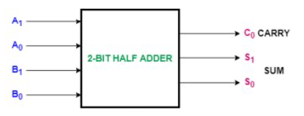
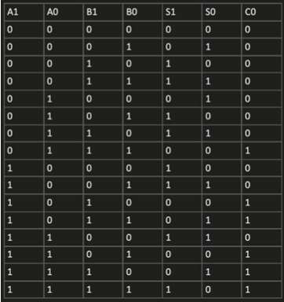
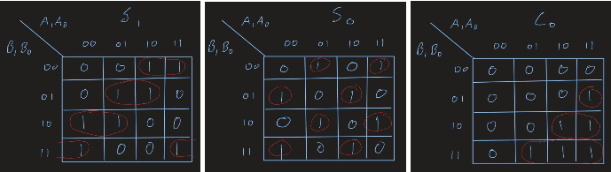
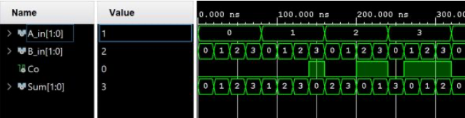
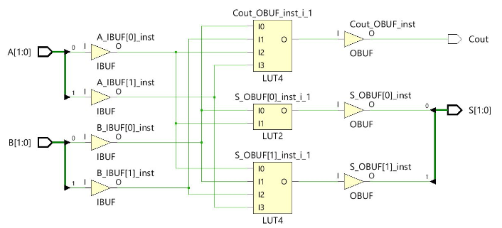
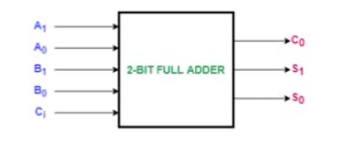
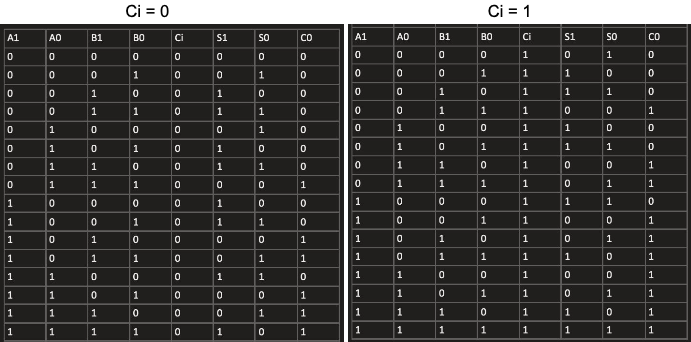
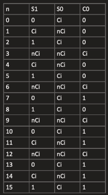
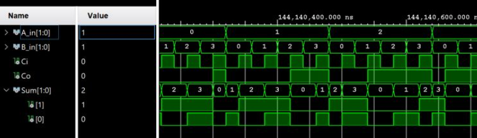
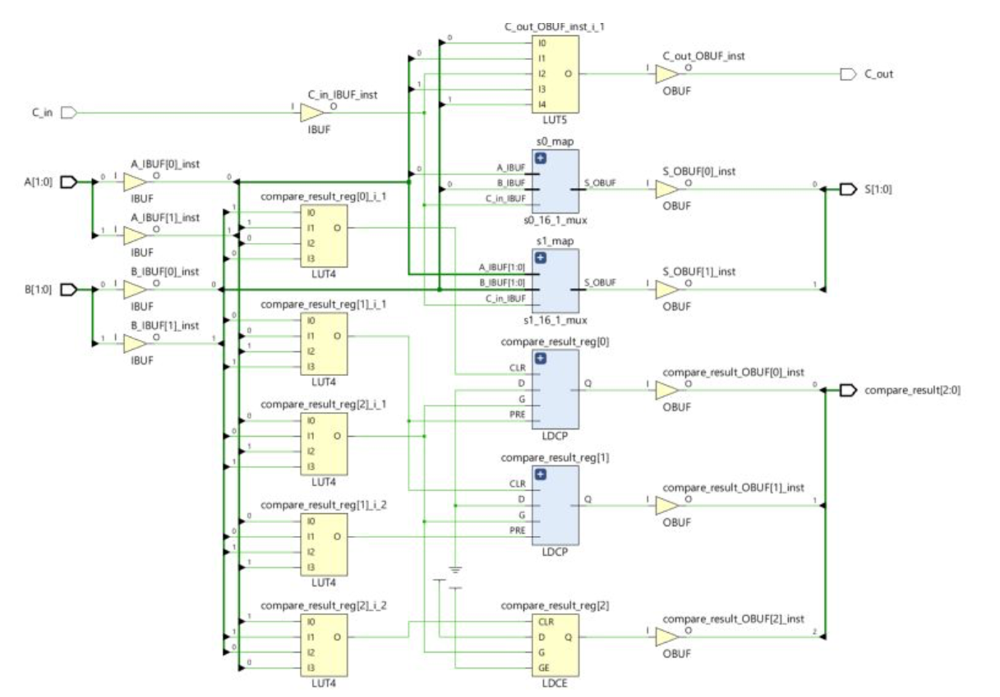

## Binary Adders

Binary Adders designed in VHDL and implemented on the Zybo Z7 board.
Truth tables are used able to simplify boolean functions that represent adder functionalities. 

### Half Adder
First design is a 2-bit half adder which takes two 2-bit inputs and adds them into a 2-bit output with an additional binary carry value. 

2-bit Half adder box diagram:

The design for the adders are started by analyzing the truth tables that describe the desired functionality of each part. 
For the half bit full adder S1S0 is the 2-bit sum of the possible input combinations. 
When the sum exceeds 3, it can no longer be represented by 2-bits and must use the carry bit.

From this table we can create the K-maps that will provide the simplest boolean expressions that represent the required functionality.

Resulting boolean equations:
S(1) = A1'A0'B1 + A1'B1B0' + A1A0'B1' + A1B1'B0' + A1'A0B1'B0 + A1A0B1B0 
S(0) = A0'B0 + A0B0'
Cout = A1B1 + A0B1B0 + A1A0B0

These three outputs are represented by 3 LEDS (led[0], led[1], led[2] respectively) on the Zybo board as outlined in the constraints file. 
The input bits are represented by the 4 switches available on the board.

The input vectors of the 2-bit full adder are to be compared to check if A>B, A<B, or A=B
and will assign RGB LED6 on the Zybo red, green or blue respectively.

### Simulation:

Half-adder RTL design schematic:

## Full Adder
The behavior of the full adder is similar except that it includes a Carry in input which has value 0/1 for all input combinations of the half adder. 
This is accomplished by using a 16x1 multiplexer for each of the 3 outputs(S0, S1, C0).

2-bit Full adder box diagram:

For this part we use the same switches for the inputs A/B, but add an extra input button to allow Carry in functionality.
The full adder the half adder truth table is recreated with an extra input for two possible scenarios - when the carry in is 0 or 1.

For each of the outputs, we can represent their functionalities using a 16x1 mux where the 4 input bits select one of the 16 lines having value 0,1, Ci, or not Ci. 
By evaluating the identical input bits to their output with varying Ci, the line will be 0 if both cases result in 0, 1 if both cases result in 1, or Ci/notCi depending on which value corresponds to the respective output.

### Simulation:

Full-Adder RTL design schematic:

